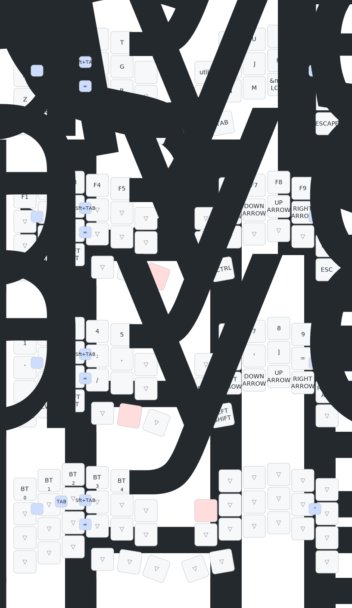

# zmk-config-roBa

## レイヤー構成

| Index | Name | 用途 |
|-------|------|------|
| 0 | default_layer | Windows用デフォルト（QWERTY配列） |
| 1 | FUNCTION | ファンクションキー（F1-F12）+ 矢印キー |
| 2 | NUM | 数字 + 記号入力 |
| 3 | utils | Bluetooth接続切り替え |
| 4 | mac_default | Mac用デフォルト（QWERTY配列） |
| 5 | mac_FUNCTION | Mac用ファンクションキー |
| 6 | mac_NUM | Mac用数字 + 記号入力 |

### レイヤー切り替え

- **FUNCTION (1)**: `lt 1 LANG1` (左親指) で長押しアクセス
- **NUM (2)**: `lt 2 SPACE` (左親指) で長押しアクセス
- **utils (3)**: `mo 3` (右手) で一時的にアクセス
- **Mac系レイヤー**: `bt_sel_mac` マクロでBluetooth接続時に自動切り替え

### 特殊機能

- **トラックボール**: 右手側に搭載、automouse-layer(4)とscroll-layers(5)で制御
- **ロータリーエンコーダー**: 左手側に搭載、スクロール操作に使用
- **コンボ**:
  - `A + S` → Tab
  - `S + D` → Shift+Tab
  - `A + Q` → 無変換 + レイヤー0へ
  - `H + J` → ダブルクォート
  - `N + M` → イコール